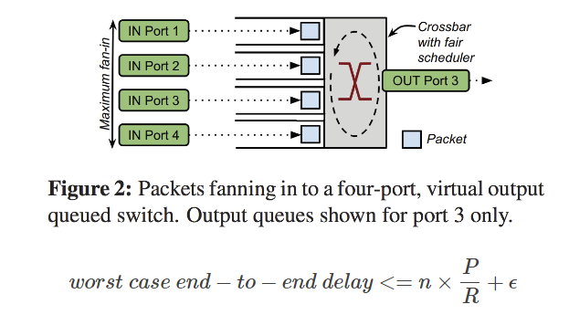
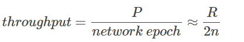
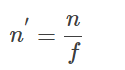

### **Aequitas: Admission Control for Performance-Critical RPCs in Datacenters**

背景：

三类RPC：

1. Performance-critical (**PC**) RPCs have tail latency SLOs. Sometimes they are associated with real-time interactive applications or carry key control traffic.
2. Non-critical (**NC**) RPCs: generally care about sustained rate and their latency SLOs are less stringent on the tail relative to PC RPCs.
3. Best-effort (**BE**) RPCs have the lowest priority, such as background backup traffic which sees no imminent disadvantage to elevated latency as long as it eventually completes. BE RPCs have no SLOs and are akin to a scavenger class

RPC network-latency (**RNL**) : the time between the first RPC packet arriving at the transport layer (such as TCP) and the time when the last packet of the RPC is acknowledged at the transport.

**Network overload**: overloads can occur anywhere in the network along the path that an RPC takes between the client and the server.

缓解网络过载的现有方案：

1. 拥塞控制：只关注通信链路的容量，提供不了RPC的延迟保证。
2. 基于优先级：根据规模将较小的流设为优先，但大小与优先级并不对齐；人为对应用进行分级来最小化完成时间，这样导致应用程序将所有RPC设为最高级。
3. 带宽共享保证：没有考虑应用程序优先级和提供RPC延迟保证。

Aequitas:

目标：为RPC优先级磊提供具有性能要求的RNL 服务等级目标（PC和NC）

面临挑战：

1. 为各种应用程序表示SLO。RPC的延迟降级可能是由计算，存储或网络的过载导致的。梳理出网络可以负责的SLO是关键。
2. 结构。鉴于网络中的任何地方都可以发生过载，因此解决方案需要处理RPC遍历路径沿任何地方出现的动态过载。
3. 规模。在一个集群中，可能有成千上万的主机，成千上万的租户和数百个应用程序，所有这些都需要在微秒尺度上进行RPC性能。

**key idea：**通过比较RNL SLO目标和实际测量值，该算法可以调整RPC运行的QoS的每个目标宿主的流量。

核心设计：

1. 将网络QoS与RPC优先级相结合：在RPC粒度上，三个优先级别在三个QoS类中进行了三个QoS类别，并配以WFQ调度算法，PC到QoSh，NC到QoSm，BE到QoSl。算法只为QoSh，QoSm提供SLO。
2. 通过QoS降级的分布式准入控制以提供RNL SLOs：通过通知准入概率去为给定RPC设置请求的QoS。这控制了跨QoS级别接收的RPC的一部分，以满足RNL SLOS。与传统的准入控制机制不同，这些机制降低或限制流量，Aequitas降低了未允许的RPC，并在最低的QoS级别上发出。这个算法通过AIMD进行控制准入概率。

### **Queues Don’t Matter When You Can JUMP Them**

**核心思想**

rate limiting 与 priority value 相结合, 来保证 latency

**Motivation**

解决数据中心网络中 network interference 问题: congestion from throughput-intensive applications causes queueing that delays traffic from latency-sensitive applications.

实际上与DCTCP解决的问题有相似之处, latency来自于排队, 而大流占据队列使得小流的排队长, DCTCP通过减小queue长度来降低latency, 采用per-flow的拥塞控制+switch的ECN标记. QJUMP从应用的角度解决network interference来保证latency

**Design**

- **Single Switch Service Model**

​	P是最大包尺寸（bit），R是最慢链接上的速率（bit/s），伊普斯龙是交换跳引入的累计处理延迟

> 如果我们能找到服务延迟的界限，我们就可以对主机进行速率限制，使它们永远不会经历排队延迟。

- **network epoch**
  网络epoch是空闲网络为来自每个发送主机的一个数据包提供服务所花费的最长时间，而不管这些数据包的来源、目的地或时间。 ` 每个host一个epoch只发一个包, 就能有latency的bound.` 由于时钟不同步，放宽后一个epoch应当是worst case end-to-end delay的两倍

- **QJUMP level**

  如果按照上式的所有host每个epoch发一个包, 随着host数目增多, 吞吐会下降. 对吞吐敏感的应用不友好.

  然而, 不同的应用对latency要求不同, 并且实际情况下, 不可能所有的host同时向一个目的端口发数据. 通过引入一个 factor f, 根据不同的应用放宽host的数目, 也就是引入QJUMP level. f is a “throughput factor”: as the value of f grows, so does the amount of bandwidth available.

  > 使用硬件优先级一起运行不同的QJump级别，但彼此隔离。

​			

​		f=1时, 一个epoch能发1个包保证latency; f=n时, 一个epoch能发n个包保证throughput. QJUMP level利用网络支持的优先级实现:对于每个优先级，指定一个		不同的值f，优先级越高，值越小。由于f的小值意味着一个激进的速率限制，优先级变得有用，因为它们不再是“自由”的。